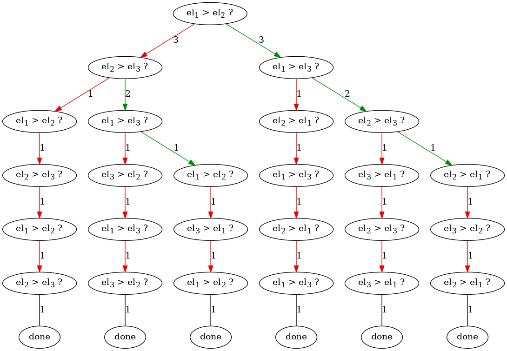
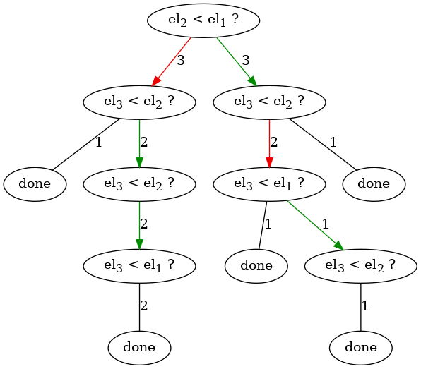

## Разбалловка
можно получить суммарно 10 баллов.

* 3 балла за механизм запоминания того, для какой последовательности в каком порядке происходят сравнения
* 2 балла за умение представить (в `.dot` файле ок) информацию о порядке сравнений в виде чего-то похожего на дерево (e.g. граф или дерево с непроективными какими-то ветвями)
  * \+ ещё 1 балл за умение представить информацию о порядке сравнений в виде именно дерева (в `.dot` файле ок)

* 2 балла за умение записать дерево с информацией о порядке сравнений в валидный .dot файл (если не можете получить это дерево из сортировки, сделайте себе генератор аналогичных рандомных деревьев)

* 0.5 балла за реализацию какой-то одной сортировки
* 0.5 балла за анализ времени работы сортировки в терминах количества сравнений и дерева
* 0.5 балл за реализацию какой-то ещё одной сортировки
* 0.5 балла за анализ времени работы второй сортировки в терминах количества сравнений и дерева

* если на ваш код будет ругаться [pep-8](http://pep8online.com/) проверяльщик кода, вы потеряете один балл.
за плохие имена переменных (противоречащие своей сути e.g. my_list для переменной хранящей чиселку или просто неинформативные a,b,x ) — тоже. (суммарно больше балла потерять нельзя).


# Домашнее задание про сортировки

В домашней работе вам предстоит проиллюстрировать основную идею теоремы об асимптотике сортировок сравнением -- дерево сравнений.
* [теоретическая справка](#теоретическая-справка)
* [формальная постановка задачи](#формальная-постановка-задачи)
* [советы](#советы)
## Теоретическая справка
Дерево сравнений сортировки устроено следующим образом.
Узлы дерева -- операции, указывающие, какие сейчас элементы сравниваются. 
От вершины может исходить ветвь к дочерней вершине, показывающей, какие затем сравниваются элементы при *том* или *ином* результате сравнения.

Например, ниже представлены два дерева сравнений: для `bubble sort` и функции `sorted` (нижняя иллюстрация) питона на последовательностях длины 3.

### дерево сравнений bubble sort


### дерево сравнений sorted


#### описание дерева сравнений sorted
Известно, что всего разных последовательностей длины 3 можно вообразить шесть: 
```
(0, 1, 2), (0, 2, 1), (1, 0, 2), 
(1, 2, 0), (2, 0, 1), (2, 1, 0)
```
Какая бы из таких последовательностей ни поступила на вход в sorted, сначала, сравниваются второй и первый элементы.  
Вне зависимости от сравнения (хотя в трёх случаях в этом сравнении побеждает один элемент, а в трёх -- другой ) затем сравниваются третий и второй элементы.  
Иногда после этого сортировка больше не производит сравнений, а иногда -- делает ещё пару.

В конце концов, любой путь от корня до листа в таком дереве соответствует истории того, как сортировка вела себя на каком-то определённом входе.

**Note:** обратите внимание на примеры деревьев для последовательностей длины 4, находящиеся в репозитории.

## Формальная постановка задачи
Ваша задача -- сочинить механизм, способный получить `сортировку` (функцию, например `sorted` в питоне) и `длину_коллекции` (число) и построить дерево сравнений переданной сортировки для коллекции заданной длины.

Дерево сравнений для сортировки нужно получить эмпирически: поставив эксперименты по упорядочиванию всех возможных последовательностей переданной длины.  
Обратите внимание на то, что ваша функция не может модифицировать код переданной сортировки, так как получает объект.

### Подзадачи
1. сочинить предложенный механизм логирования асимптотики сортировок
2. реализовать запись дерева сортировки в файл в формате `dot`. (см приложенный [`sorted_3.dot`](sorted_3.dot), описывающий файл, из которого получена иллюстрация работы sorted командой `dot -Tpng sorted_3.dot > res3_sorted.png`
3. взять три сортировки на питоне -- sorted, упомянутую в курсе, любую ещё одну  -- и провести эксперимент по оценке асимптотики выбранных сортировок на последовательностях длины 3, 4, 5.

## Советы
Для записи деревьев и графов разработан открытый [язык *dot*](https://www.graphviz.org/pdf/dotguide.pdf). С ним умеет работать [GraphViz](https://www.graphviz.org/about/). Упомянутая выше программа `dot` -- часть GraphViz. Авторы задачи убеждены в адекватности работы dot в linux, колабе и wsl, но не исследовани поведение на других ОС.

Обратите внимание на возможность сочинить свою операцию сравнения
